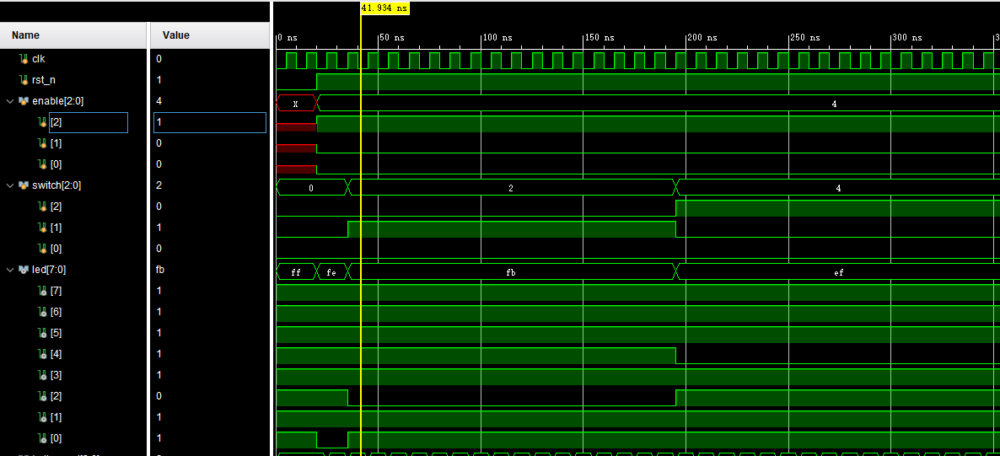

# 数字逻辑实验一 | 波形分析

> 200110617 蔡嘉豪

## 3-8 译码器

该译码器使用组合逻辑实现，其中

+ `enable[2:0]` 是控制开关
+ `switch[2:0]` 输入 3 位二进制数
+ `led[7:0]` 显示将输入的二进制数转成的十进制数结果（低有效）

从波形图中的 `led` 可见，`enable` 的值为 `3'b100` 时，译码器开始正常工作

表现为：当 `switch` 输入 `3'b000` 时，`led[0]` 为低电平

另外，从后面部分波形可见，当输入 `3'b010` 时，应该输出的十进制数是 2，此时 `led[2]` 为低电平，其他输入情况也正确，不一一赘述.

