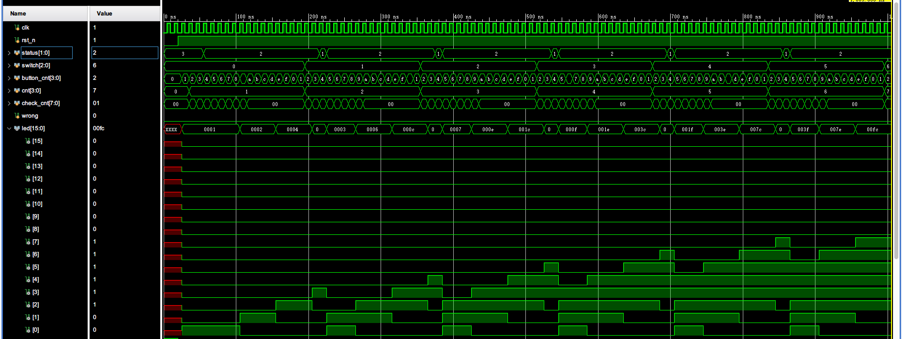

# 数字逻辑实验二 | 波形分析

> 200110617 蔡嘉豪

## 流水灯

该流水灯使用时序逻辑实现，时钟频率为 100 MHz，也就是 10 ns 振动一次（从波形图第一行也可看出）

此处为了仿真波形能呈现更多信息，将时钟调整为每 4 个时钟周期清零一次，每到第 3 个时钟周期时，LED 切换.

从图中可见，大约每 30 ns，`led` 的高电平位置就会顺序切换到下一位.

而且在最开始的一小部分（约 0 ~ 10 ns 时），`rst` 为高电平时，只有 `led[0]` 为高电平，并且是当 `rst` 换成低电平时，才开始计时间并切换 `led` 的高电平位置

## 节日彩灯

节日彩灯使用时序逻辑实现，时钟频率为 100 Mhz，同上

此处为了仿真波形能呈现更多信息，将时钟调整为每 4 个时钟周期清零一次，每到第 4 个时钟周期时，LED 切换.

从图中可见，每次 `switch` 改变的时候，`button` 会被触发一次，相应地，`led` 会复位并改变亮灯的个数，同时，随着计数的进行，`led` 会等时间间隔地移位，都可以从图中看出来