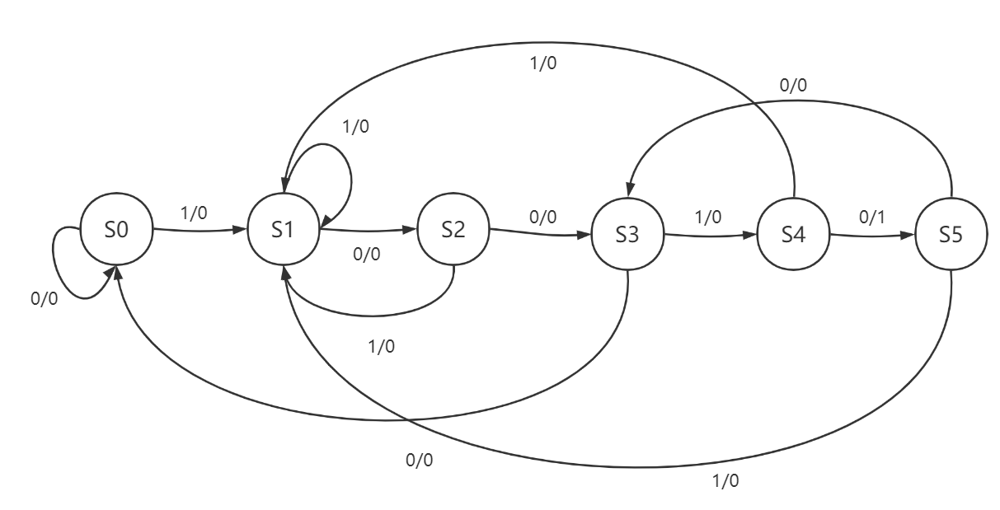

# 数字逻辑实验五 | 波形分析

> 200110617 蔡嘉豪

## 一、概述

本实验要求设计一个Moore型或Mealy型的状态机，用于检测一个8位的二进制数中，是否存在“10010”的子序列

## 二、总思路

显然应该使用 Mealy 型状态机，因为本实验中，状态机的输出不仅和现态有关而且和当前输入（当前匹配到的字符）有关

使用三段式描述状态机，分为以下三段：
+ 控制设备工作状态跳转 + 控制状态机状态跳转
+ 说明状态机的跳转规则（即描述状态转换图）
+ 控制状态机的输出和 led 的亮灭

## 三、状态定义和转换

**设备状态：**

```verilog
reg [1:0] device_state;
parameter DEVICE_OFF = 2'b00;    // 关机
parameter DEVICE_READY = 2'b01;  // 准备
parameter DEVICE_RUN = 2'b10;    // 运行
```

**状态转换图：**

此处设 $S_0$ 为初始状态，省略 IDLE 状态



## 四、波形分析


从图中可见，当 `device_status` 从 1 变成 2 时，设备进入工作状态，指示当前字符位置的 `current_char_pos` 也开始从 7 往下倒数，逐个遍历 `switch[7:0]` 序列，与此同时，自动机当前状态 `current_state` 开始变化，与下一状态 `next_state` 相差一个时钟周期

testbench 提供的第一个用于测试的序列是 `00100101`，可以看到，用于显示当前字符的 `bit` 随着时钟周期的电平变化也为 `00100101`，与此同时，状态机从检测到第一个 `1` 开始，状态很顺利地从 $S_0$ 依次转到了 $S_5$，进入 $S_5$ 表示 `10010` 字符串匹配成功，即检测到目标序列，此时 `led` 电平拉高，led 灯亮

与此例相对比的是下一个测试序列 `00101001`，此序列中不含有目标序列 `10010`，可以看到状态机的 `current_state` 最多跳转到 $S_3$，无法进入 $S_5$，因此匹配失败，`led` 电平不拉高，表示 led 灯不亮，没有检测到目标序列

后续测试序列与上述同理，不再赘述